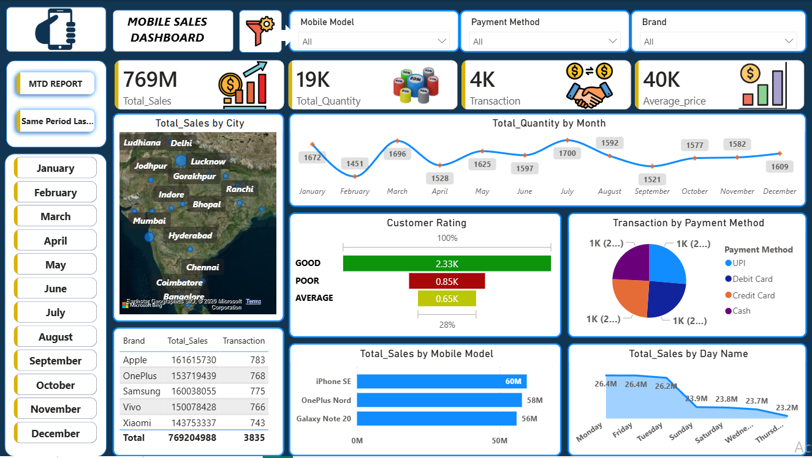
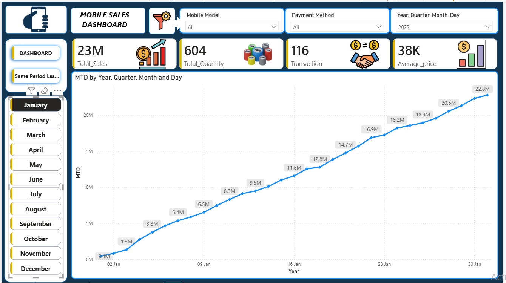
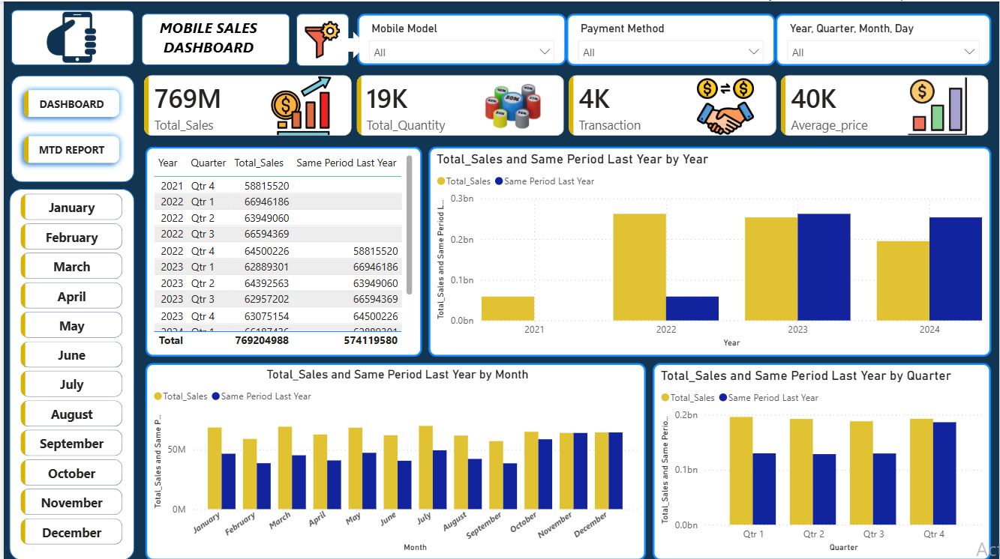

# 📊 Mobile Sales Dashboard – Power BI Project

## 📘 Project Overview
This project showcases a complete end-to-end **Power BI data analytics workflow**, starting from data understanding, data cleaning, modeling, and DAX calculations to designing a fully interactive multi-page dashboard report.  
The report provides insights into **mobile sales performance**, **quantity trends**, **monthly and quarterly comparisons**, and **same-period last year analysis**.

The final report contains **three pages**:
1. **Dashboard**  
2. **MTD (Month-to-Date) Report**  
3. **Same Period Last Year Report**

---

## 🛠️ Tools Used

### **🔹 Power BI Desktop**
- Data cleaning using **Power Query**  
- Data modeling  
- DAX calculations  
- Dashboard & report design  

### **🔹 Excel / CSV**
- Source data  
- Pre-processing & quick validation  

### **🔹 DAX (Data Analysis Expressions)**
- Time-intelligence measures  
- KPI calculations  
- Custom aggregations  

### **🔹 Power Query (M Language)**
- Data transformation  
- Custom calendar table  
- Column creation & normalization  

---

## 🖼️ Screenshots

### **Dashboard Page**

### **MTD Report Page**

### **Same Period Last Year Page**

> 📌 *Rename your actual screenshot files as*  
`Screenshot1.png`, `Screenshot2.png`, `Screenshot3.png`  
*or update the file names in the links.*

---

## 📥 1. Data Understanding & Import
- Explored dataset consisting of sales, model, payment, and customer-related fields.
- Imported data into Power BI Desktop.
- Used **Power Query** for cleaning, transforming, and shaping the dataset.

---

## 🧹 2. Data Cleaning (Power Query)
Performed data cleaning operations such as:
- Removing duplicates  
- Handling missing values  
- Correcting data types  
- Splitting and merging columns  
- Creating custom fields  
- Standardizing date column structure  

---

## 📅 3. Custom Calendar Table
Created a **Calendar Table** using Power Query to support:
- Time-intelligence functions  
- Year-Month-Quarter hierarchies  
- MTD, QTD, and YTD calculations  
- Same period last year comparison  

Linked the calendar table to the fact table through **Date** using a one-to-many relationship.

---

## 🔗 4. Data Modeling & Relationships
- Implemented a **Star Schema**  
- Established relationships between dimension tables and the fact table  
- Ensured proper cardinality and cross-filter directions  
- Optimized model performance using best practices  

---

## 🧮 5. DAX Measures
Created multiple DAX measures including:
- Total Sales  
- Total Quantity  
- Total Transactions  
- Average Price  
- MTD Sales  
- Same Period Last Year Sales  
- Customer Rating Metrics  

These measures form the backbone of dynamic visuals and time-intelligence analysis.

---

## 📊 6. Dashboard & Visualizations
Designed clean, professional, interactive visuals including:
- **Cards** (Sales, Quantity, Transactions, Avg Price)  
- **Line Charts** (Monthly quantity trends)  
- **Bar Charts** (Sales by model, sales by month, sales by quarter)  
- **Pie Chart** (Payment method analysis)  
- **Map Visualization** (Sales by city)  
- **KPI Indicators**  
- **Navigation buttons** for seamless page movement  

---

## 📄 7. Report Pages

### **1️⃣ Dashboard Page**
Includes:
- Yearly KPIs  
- City-level map visualization  
- Customer Rating bar  
- Sales by Mobile Model  
- Sales by Payment Method  
- Total Sales by Day Name  
- Monthly trend analysis  

### **2️⃣ MTD Report Page**
Highlights Month-to-Date insights:
- MTD Sales  
- MTD Quantity  
- Daily trend charts  
- Category-level KPIs  
- Comparison with previous month  

### **3️⃣ Same Period Last Year Page**
Provides time-intelligence comparative insights:
- Year-over-year comparison charts  
- Monthly same-period comparison  
- Quarterly performance metrics  
- Annual trend visualization  

---

## 🎨 Design Highlights
- Custom color theme (blue, yellow, white)  
- Professional minimalist UI  
- Consistent card and chart styling  
- Clean spacing and visual balance  
- Intuitive navigation buttons  

---

## 🚀 Key Learnings & Takeaways
- Strong experience in **Power BI development**  
- Ability to design end-to-end dashboards  
- Practical understanding of **DAX** & **Data Modeling**  
- Implementing business-ready analytical reports  

---

## 📁 Files Included
- `Mobile Sales.pbix` Power BI report file  
- Dataset files  
- Dashboard screenshots  
- Supporting documentation  

---

## 📌 How to Use
1. Download or clone the repository  
2. Open `.pbix` file in Power BI Desktop  
3. Refresh the dataset if needed  
4. Explore interactive visuals across all pages  

---

## 🏁 Conclusion
This project demonstrates the complete workflow of building a professional Power BI dashboard from raw data to an insightful, interactive multi-page report.  
A perfect addition to your **data analytics portfolio**.

---
